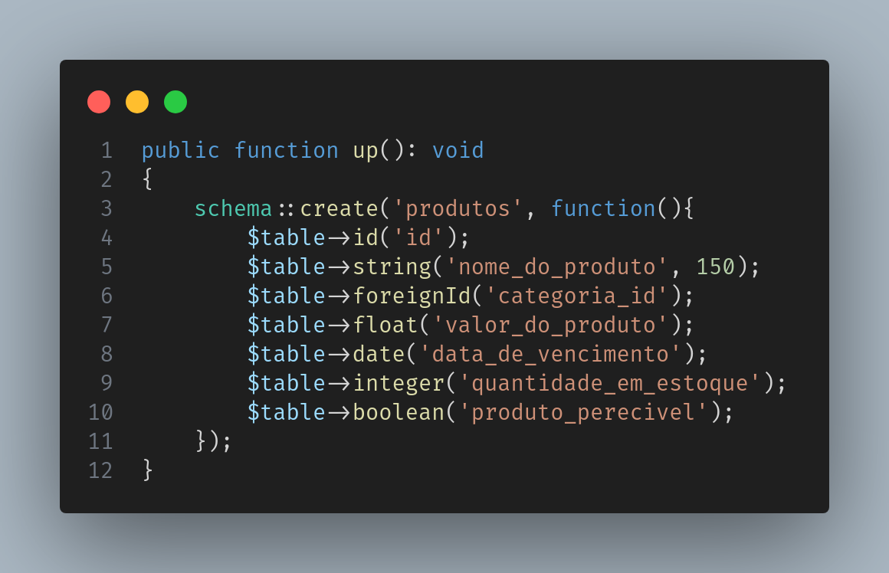

# Conteúdo do Arquivo:
- [Introdução](#introdução)
- [Pré-Requisitos](#pré-requisitos)
- [Como-rodar-localmente](#como-rodar-localmente)
- [CodeShots](#codeshots)
- [DemoShots](#demo)
- [Conclusão](#conclusão)

## Introdução

Este projeto foi parte de um desafio técnico da empresa [Ui Tecnologia](https://www.linkedin.com/company/uitecnologia/).

A descrição do desafio é a seguinte:

- O aplicativo deverá permitir a criação, leitura, atualização e exclusão de produtos.
- Os campos do produto são os seguintes:
    - Nome do Produto: uma string que representa o nome do produto.
    - Categoria: uma chave estrangeira que referencia a categoria à qual o produto pertence.
    - Valor do Produto: um número de ponto flutuante que representa o valor monetário do produto.
    - Data de Vencimento: uma data que indica a data limite de validade do produto.
    - Quantidade em Estoque: um número inteiro que representa a quantidade disponível em estoque.
    - Produto Perecível: um valor booleano que indica se o produto é perecível ou não.
- O frontend deverá apresentar uma interface amigável ao usuário, permitindo que ele
visualize, crie, edite e exclua produtos. Será necessário criar formulários para a criação e
edição de produtos, além de exibir a lista de produtos existentes.
- O backend deverá fornecer uma API RESTful para o frontend se comunicar. Será
necessário implementar rotas para criar, ler, atualizar e excluir produtos no banco de
dados PostgreSQL
- O banco de dados PostgreSQL será responsável pelo armazenamento persistente dos
produtos. Será necessário criar uma estrutura de tabelas que representam os campos
mencionados acima, bem como estabelecer relacionamentos entre as tabelas, como a
relação entre produto e categoria.

## Pré Requisitos

- PHP 8.1.2 ou versão mais recente.
- Composer 2.6.5 ou versão mais recente.
- Angular CLI: 17.0.6 ou versão mais recente.
- Node: 18.17.1 ou versão mais recente.
- Package Manager: npm 9.6.7 ou versão mais recente.
- Banco de dados: psql (PostgreSQL) 14.10 ou versão mais recente.
- SGBD: Preferência pessoal - No projeto utilizei o Beekeeper Studio

## Como Rodar Localmente

Primeiramente clone o projeto:

```CLI
git clone https://github.com/Killjoybr/desafio-ui-tecnologia.git
```

Navegue até o diretório do projeto
```CLI
cd ./Caminho-Para-O-Diretorio/desafio-ui-tecnologia
```

Estando no diretório do projeto você deverá ver a seguinte strutura de pastas
desafio-ui-tecnologia (raiz) <br>
| <br>
---/ assets (Prints do código) <br>
| <br>
---/ backend (Diretório da lógica do servidor com PHP/Laravel) <br>
| <br>
---/ db (Diretório do Banco de Dados) <br>
| <br>
---/ frontend (Diretório do Frontend com Angular) <br>
| <br>
---./.gitignore (Arquivo gitignore) <br>
| <br>
---./LICENSE (licensa do projeto) <br>
| <br>
---./README.md (Arquivo que você está lendo) <br>

Para instalar as dependencias do PHP/Laravel, navegue até o diretório desafio-ui-tecnologia/backend/src e rode o seguinte comando:
```CLI
composer install
```
Este comando irá instalar as dependencias necessárias para rodar o backend

Para instalar as dependencias do Angular você deverá rodar o comando npm install nos seguintes diretórios:
- desafio-ui-tecnologia/frontend
     ```CLI
     npm install
     ```
- desafio-ui-tecnologia/frontend/uitec
     ```CLI
     npm install
     ```

Com seu SGBD escolhido rode o script localizado no diretório do banco de dados.

Inicie o backend rodando o comando no diretório ./backend/src: 
```CLI
php artisan serve
```

Inicie o frontend rodando o comando no diretório ./frontend/uitec: 
```CLI
ng serve 
```
Se tiver utilizando o Angular apenas no projeto o comando é esse:
```CLI
npx ng serve
```
Após rodar o comando inicializando o frontend copie a url fornecida e acesse pelo seu navegador. <br>
Será algo semelhante a isso: ```http://localhost:4200/```

Pronto você está acessando o projeto!

## Codeshots
**Backend:**





**Frontend:**


## Demo
**Tela Cadastro**


**Tela Tabelas**


## Conclusão

Este projeto foi meu primeiro contato com os frameworks: Laravel & Angular.
Também meu primeiro contato com o PHP.

Gostei bastante do framework Laravel, eu tinha um certo preconceito com a linguagem PHP, esse projeto me mostrou o potencial de um framework quando se tem uma base forte das abstrações que ele faz e como utilizar isso ao seu favor.

Por outro lado, não tenho tanta afinidade no frontend, o uso do framework me trouxe alguns gargalos, mas também se mostrou bem útil além de apontar minhas áreas de melhoria.

Espero que esse projeto mostre um pouco das minhas capacidades, seja você a pessoa que está me avaliando ou apenas olhando meus projetos, fico à disponibilidade para tirar eventuais dúvidas, caso queira iniciar colaboração ou apenas conversar, sinta-se à vontade para entrar em contato nas redes disponíveis no meu [website](https://www.killjoybr.com.br)!